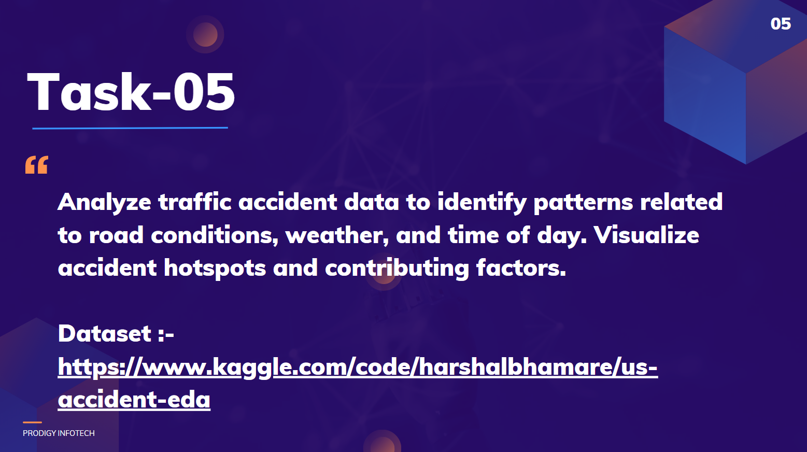

# TASK-5
Analyze traffic accident data to identify patterns related to road conditions, weather, and time of day. Visualize accident hotspots and contributing factors.
# Prodigy InfoTech Data Science Internship Task 5
 

<!-- Welcome message for the task submission -->
Welcome to my submission for Task 5 of the Data Science Internship at Prodigy Infotech. In this task, I have analyzed traffic accident data to identify patterns related to road conditions, weather, and time of day, and visualized accident hotspots and contributing factors.

## Dataset

<!-- Description of the dataset used for the analysis -->
The dataset used for this task is <a href="RTA Dataset.csv">RTA_Dataset</a>. The dataset used for this task contains records of traffic accidents, including details such as road conditions, weather, time of day, and location. 

## Tools and Libraries Used
<!-- Tools and libraries involved in the analysis -->
- Jupyter notebook
- Pandas
- Numpy
- Matplotlib & Seaborn for visualizations
- Folium for interactive maps

## Traffic Accident Analysis Process

<!-- Steps taken during the analysis process -->
During the analysis, I performed the following steps:

1. **Data Cleaning**: Checked for missing values, duplicates, and outliers in the dataset and handled them accordingly.
  
2. **Pattern Identification**: 
   - Analyzed correlations between accidents and factors such as weather, road conditions, and time of day.
   - Investigated peak accident times and how weather conditions impact accident rates.

3. **Visualization**: 
   - Created heatmaps to identify accident hotspots.
   - Developed charts to visualize how different conditions contribute to accidents.

## Conclusion

<!-- Final summary and conclusions derived from the analysis -->
In conclusion, the analysis revealed significant patterns related to road conditions, weather, and time of day. Identifying accident hotspots and contributing factors can help improve road safety by implementing preventive measures in high-risk areas.

Thank you for reviewing my submission!

## 📬 Contact

<!-- Contact information for inquiries or feedback -->
For any inquiries or feedback regarding this project, please contact:

- <a>[Pramod Doddmane](https://www.linkedin.com/in/pramoddr) (LinkedIn)</a>
- Email: pramoddoddmane@gmail.com
